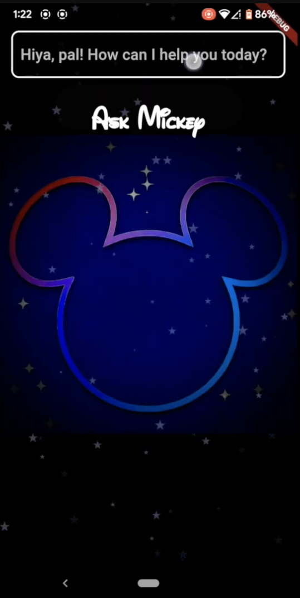
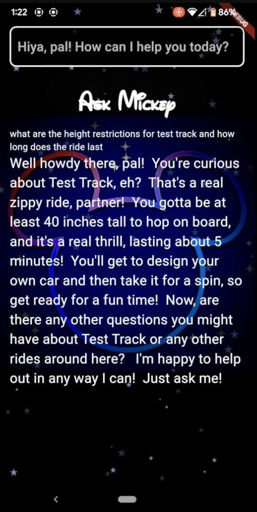
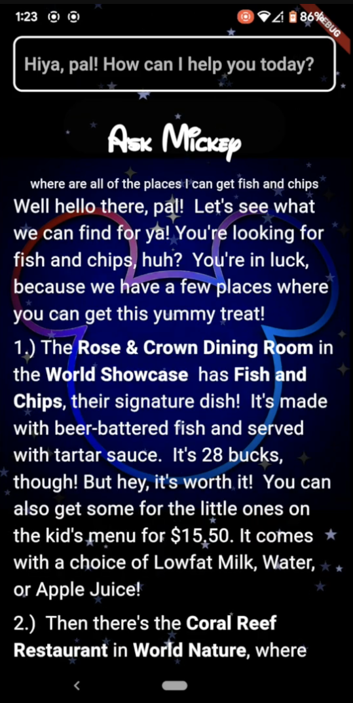
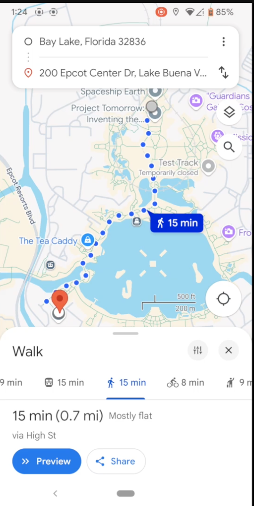
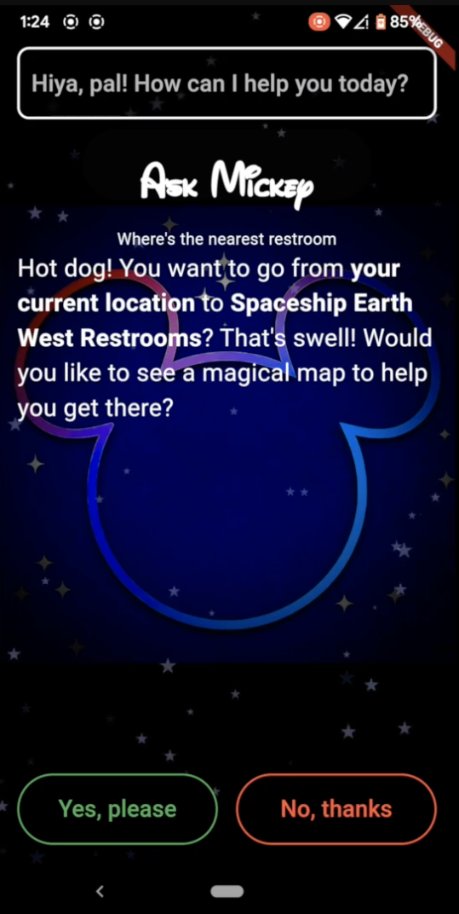
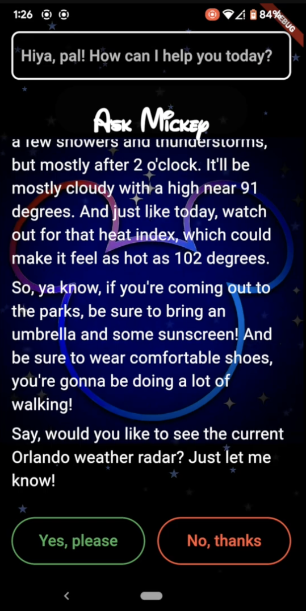

# AskMickey

## Overview

AskMickey is a Flutter app that implements a classify-then-route pattern on top of Gemini for Walt Disney World guests. Every query is classified first, then routed to a dedicated handler that assembles a domain-specific prompt with injected context before any LLM call occurs. Safety handlers for inappropriate or off-topic input are triggered at classification time. The current release is an EPCOT-only MVP.

For technical depth on the system's architecture, see [ARCHITECTURE.md](./ARCHITECTURE.md).

**Build mode.** Architecture, code, and prompt design by me. This project predates my current AI-assisted workflow. It shows what I produce solo.

## Demo

[](https://www.youtube.com/watch?v=tvfP0SIrxjA)

## Screenshots

| Home | Attraction Info | Dining |
|---|---|---|
|  |  |  |

| Maps Query | Restroom Query | Weather |
|---|---|---|
|  |  |  |


## Features

### Classification and Routing
- Gemini classifies every incoming query into a fixed set of categories before any generative call is made
- Routes to specialized handlers: `AttractionInfo`, `Dining`/`Menu`, `Weather`, `Maps`, `AttractionQueue`, `FunFacts`, `ParkingLocation`, `ConversationContinuation`
- Explicit fallback categories (`InappropriatePrompt`, `NotDisneyRelated`, `IndeterminateCategory`) short-circuit unsafe or off-domain queries

### Data Retrieval and Prompt Pipelines
- Real-time data (wait times, weather, dining options) is fetched and injected into handler-specific prompts
- Static data (parking locations, navigation helpers, Disney facts) is supplied through the same prompt-construction step
- Each handler builds its own constrained prompt, calls `GeminiService`, and returns a `PromptResult`

### Safety and Domain Constraints
- Early classification plus per-handler prompt engineering keeps Gemini inside the Walt Disney World domain
- Dedicated safety paths prevent the model from answering inappropriate or unrelated questions

### Conversation and Presentation
- Stateful conversation handling supports follow-up questions within the same intent
- Animated Mickey-themed UI with starry background

## Getting Started

1. Clone the repository

```bash
git clone https://github.com/williamcs50/AskMickey.git
cd AskMickey
```

2. Set up your Gemini API key

```bash
cp .env.example .env
```

Edit .env and add your key:

```bash
GEMINI_API_KEY=your_gemini_api_key_here
```

3. Install dependencies

```bash
flutter pub get
```

4. Run the app

```bash
flutter run
```

### Platform Support

Tested on iOS, macOS, and web. Other Flutter targets (Android, Windows, Linux) are untested.

## Architecture

AskMickey uses a lightweight classify-then-route pattern powered by Gemini. Queries are classified first, then routed into dedicated handlers that assemble constrained, domain-specific prompts before any model call is made. See [ARCHITECTURE.md](./ARCHITECTURE.md) for the full system design, component relationships, and future considerations.

## Project Status

**MVP – EPCOT Only**

Flutter app with Gemini integration, built for EPCOT.

Core capabilities implemented:

- Query classification and routing to intent-specific handlers before any LLM generation
- Real-time and static data retrieval through modular prompt pipelines
- Safety handlers and domain constraints
- Modular structure for adding other parks later

Functional but early stage.
